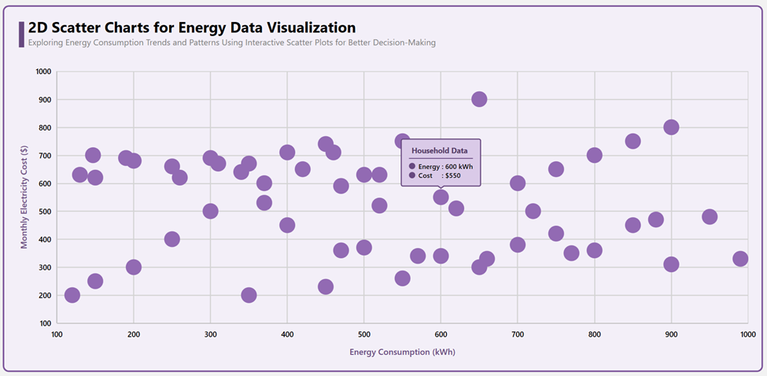
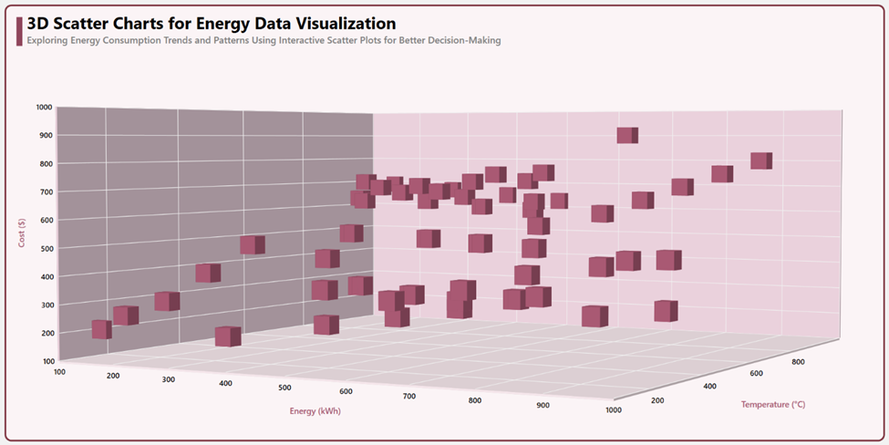

# 2D-vs-3D-Scatter-Charts-in-Energy-Data--Clarity-or-Complexity
This blog compares 2D and 3D scatter charts for visualizing energy data, highlighting their clarity, complexity, and ideal use cases. It offers insights into when to choose each chart type for effective data representation.

## Understanding 2D Scatter Charts
A 2D scatter chart is a simple and effective way to visualize relationships between two numerical variables. It plots data points along the X and Y axes, making it easy to identify patterns, correlations, and clusters.

### Advantages of 2D Scatter Charts for Energy Data:
* Simplicity and Readability: The absence of depth eliminates visual clutter, making patterns more discernible.
* Efficient Comparison: Easier to compare multiple datasets with different markers and colors.
* Performance-Friendly: 2D rendering is lightweight and works efficiently, even with large datasets.

## Exploring 3D Scatter Charts
3D scatter charts introduce a Z-axis, allowing visualization of three variables in a single view. This can be beneficial for complex energy datasets requiring an additional dimension.

### Advantages of 3D Scatter Charts for Energy Data:
* Extra Dimension: Allows for the inclusion of a third variable without requiring additional charts.
* Enhanced Perspective: Can provide a more holistic view of multi-variable energy interactions.
* Dynamic Rotation: Interactive 3D charts help explore data from different angles.

## Troubleshooting:
### Path too long exception:
If you encounter a path too long exception when building this example project, close Visual Studio and rename the repository to a shorter name before building the project.

For a step-by-step procedure, refer to the [2D-vs-3D-Scatter-Charts-in-Energy-Data--Clarity-or-Complexity? blog]().